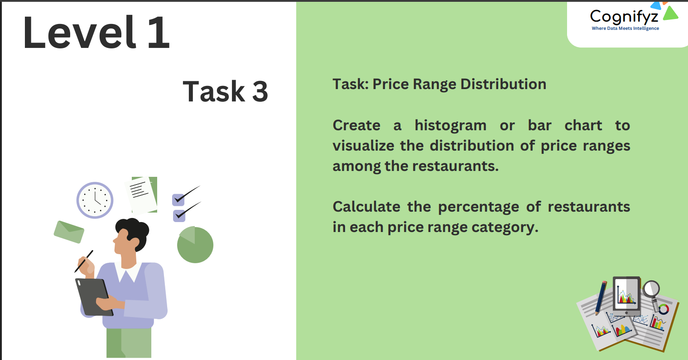

---

# **📊 Data Analysis Internship - Level 1 (Task 3)**
# 🌟 Restaurant Data Analysis: Ratings & Pricing Trends  

  

## 📚 Introduction  
This project is part of my **Level 1 Data Analysis Internship**, where I analyze a dataset containing **restaurant ratings, pricing trends, and customer preferences**.  

By utilizing **Python, Pandas, NumPy, Matplotlib, and Seaborn**, I performed:  
✔️ **Data Cleaning**  
✔️ **Trend Analysis**  
✔️ **Visualizations**  

**🌟 Goal:** To understand how pricing affects restaurant ratings and which restaurant types receive the highest satisfaction.  

---  
 

## 📌 Task Overview  
This project is part of my **Data Analysis Internship - Level 1 (Task 3)**.  

In this analysis, I:  
✔️ Examined **rating distribution** across different price ranges.  
✔️ Identified **correlation** between pricing and ratings.  

🔍 This helps businesses understand **how pricing impacts customer ratings** and where the highest-rated restaurants are located.  

---  

## 🔍 Solution Walkthrough  

### **1️⃣ Data Preparation**  
- Imported necessary libraries:  
  ```python
  import pandas as pd
  import numpy as np
  import matplotlib.pyplot as plt
  import seaborn as sns
  ```  
- Loaded the dataset from a **CSV file** and checked for missing values:  
  ```python
  df = pd.read_csv("data/restaurant_data.csv")
  df.info()
  ```  
- Cleaned data by handling **missing values** and fixing **inconsistencies**.  

### **2️⃣ Rating & Pricing Analysis**  
- Examined **restaurant rating distribution**.  
- Segmented restaurants by **pricing categories** (low, medium, high).  
- Checked whether **higher-priced restaurants** receive better ratings.  
- Used **correlation analysis** to study relationships between price and ratings:  
  ```python
  correlation = df[['Price Range', 'Rating']].corr()
  sns.heatmap(correlation, annot=True, cmap='coolwarm')
  ```  

---  

## 📊 Results Demonstration  

### **🔍 Key Insights (Summary)**  

📌 **1. Most Restaurants:** *New Delhi has the highest number of restaurants (5,473), indicating high competition and food demand.*  

📌 **2. Highest Average Rating:** *Inner City has the best-rated restaurants (4.90), suggesting better food quality and customer satisfaction.*  

📌 **3. Pricing Impact on Ratings:** *Higher-priced restaurants tend to have slightly better ratings, but some affordable restaurants also perform exceptionally well!*  

### 🌟 **Visualizations:**  
_(Click to Expand)_  
  
  

---  

## 🎥 Video Walkthrough  
🎥 Watch my **detailed explanation** of the analysis **[here](https://your-video-link.com)**.  

---  

## 📌 Next Steps  
📊 **Further Analysis:** Exploring other factors like **location demographics & cuisine types**.  
🔍 **Enhancing Visualizations:** Using **interactive charts** (Plotly, Dash) for deeper insights.  
📍 **Machine Learning:** Predicting **restaurant ratings** based on features.  

---  

## 🤖 Tools & Technologies  
✅ **Programming:** Python (Pandas, NumPy)  
✅ **Visualization:** Matplotlib, Seaborn  
✅ **Data Processing:** Jupyter Notebook  

---  

## 📢 Contributing  
Want to **improve this project**? 😊  
✔️ **Fork the repo**  
✔️ **Submit pull requests**  
✔️ **Suggest improvements via GitHub Issues**  

---  

## 🌟 Let's Connect!  
If you liked this project, don't forget to **star ⭐ this repository** and follow me for more data science projects! 🚀  


